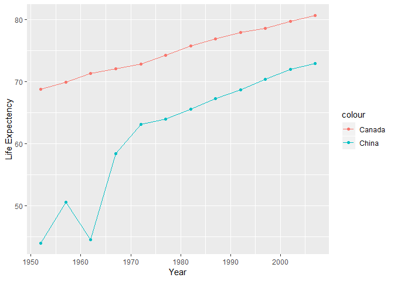
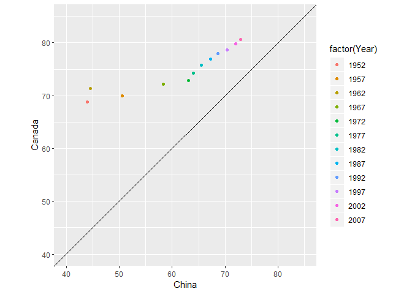

STAT 545A homework 4
================
Tian Gao
2018/10/2

# Bring rectangular data in

``` r
## load gapminder
library(gapminder)
## load tidyverse
library(tidyverse)
```

    ## -- Attaching packages --------------------------------------- tidyverse 1.2.1 --

    ## √ ggplot2 3.0.0     √ purrr   0.2.5
    ## √ tibble  1.4.2     √ dplyr   0.7.6
    ## √ tidyr   0.8.1     √ stringr 1.3.1
    ## √ readr   1.1.1     √ forcats 0.3.0

    ## -- Conflicts ------------------------------------------ tidyverse_conflicts() --
    ## x dplyr::filter() masks stats::filter()
    ## x dplyr::lag()    masks stats::lag()

# Data Reshaping Prompts (and relationship to aggregation)

# Activity \#2

  - Make a tibble with one row per year and columns for life expectancy
    for two or more countries.
  - Use knitr::kable() to make this table look pretty in your rendered
    homework.
  - Take advantage of this new data shape to scatterplot life expectancy
    for one country against that of another.

<!-- end list -->

``` r
life_contrast<-gapminder %>%
# Filter the country to China and United States
  filter(country %in% c("China","Canada"))%>%
  select(year, country, lifeExp) %>%
# reshape the data, spread the country to columns, lifeExp as the values
  spread(country,lifeExp) %>%
  rename(Year = year)
knitr::kable(
  life_contrast
)
```

|    Year |    Canada |                                                      China |
| ------: | --------: | ---------------------------------------------------------: |
|    1952 |    68.750 |                                                   44.00000 |
|    1957 |    69.960 |                                                   50.54896 |
|    1962 |    71.300 |                                                   44.50136 |
|    1967 |    72.130 |                                                   58.38112 |
|    1972 |    72.880 |                                                   63.11888 |
|    1977 |    74.210 |                                                   63.96736 |
|    1982 |    75.760 |                                                   65.52500 |
|    1987 |    76.860 |                                                   67.27400 |
|    1992 |    77.950 |                                                   68.69000 |
|    1997 |    78.610 |                                                   70.42600 |
|    2002 |    79.770 |                                                   72.02800 |
|    2007 |    80.653 |                                                   72.96100 |
| \* Then | I’ll do i | t for different countries, eg the countries of a continent |

``` r
life_contrast_asia <- gapminder %>%
  filter(continent == "Asia") %>%
  select(c("year", "country", "lifeExp")) %>%
  spread(country, lifeExp)

knitr::kable(
  life_contrast_asia
)
```

| year | Afghanistan | Bahrain | Bangladesh | Cambodia |    China | Hong Kong, China |  India | Indonesia |   Iran |   Iraq | Israel |  Japan | Jordan | Korea, Dem. Rep. | Korea, Rep. | Kuwait | Lebanon | Malaysia | Mongolia | Myanmar |  Nepal |   Oman | Pakistan | Philippines | Saudi Arabia | Singapore | Sri Lanka |  Syria | Taiwan | Thailand | Vietnam | West Bank and Gaza | Yemen, Rep. |
| ---: | ----------: | ------: | ---------: | -------: | -------: | ---------------: | -----: | --------: | -----: | -----: | -----: | -----: | -----: | ---------------: | ----------: | -----: | ------: | -------: | -------: | ------: | -----: | -----: | -------: | ----------: | -----------: | --------: | --------: | -----: | -----: | -------: | ------: | -----------------: | ----------: |
| 1952 |      28.801 |  50.939 |     37.484 |   39.417 | 44.00000 |           60.960 | 37.373 |    37.468 | 44.869 | 45.320 | 65.390 | 63.030 | 43.158 |           50.056 |      47.453 | 55.565 |  55.928 |   48.463 |   42.244 |  36.319 | 36.157 | 37.578 |   43.436 |      47.752 |       39.875 |    60.396 |    57.593 | 45.883 |  58.50 |   50.848 |  40.412 |             43.160 |      32.548 |
| 1957 |      30.332 |  53.832 |     39.348 |   41.366 | 50.54896 |           64.750 | 40.249 |    39.918 | 47.181 | 48.437 | 67.840 | 65.500 | 45.669 |           54.081 |      52.681 | 58.033 |  59.489 |   52.102 |   45.248 |  41.905 | 37.686 | 40.080 |   45.557 |      51.334 |       42.868 |    63.179 |    61.456 | 48.284 |  62.40 |   53.630 |  42.887 |             45.671 |      33.970 |
| 1962 |      31.997 |  56.923 |     41.216 |   43.415 | 44.50136 |           67.650 | 43.605 |    42.518 | 49.325 | 51.457 | 69.390 | 68.730 | 48.126 |           56.656 |      55.292 | 60.470 |  62.094 |   55.737 |   48.251 |  45.108 | 39.393 | 43.165 |   47.670 |      54.757 |       45.914 |    65.798 |    62.192 | 50.305 |  65.20 |   56.061 |  45.363 |             48.127 |      35.180 |
| 1967 |      34.020 |  59.923 |     43.453 |   45.415 | 58.38112 |           70.000 | 47.193 |    45.964 | 52.469 | 54.459 | 70.750 | 71.430 | 51.629 |           59.942 |      57.716 | 64.624 |  63.870 |   59.371 |   51.253 |  49.379 | 41.472 | 46.988 |   49.800 |      56.393 |       49.901 |    67.946 |    64.266 | 53.655 |  67.50 |   58.285 |  47.838 |             51.631 |      36.984 |
| 1972 |      36.088 |  63.300 |     45.252 |   40.317 | 63.11888 |           72.000 | 50.651 |    49.203 | 55.234 | 56.950 | 71.630 | 73.420 | 56.528 |           63.983 |      62.612 | 67.712 |  65.421 |   63.010 |   53.754 |  53.070 | 43.971 | 52.143 |   51.929 |      58.065 |       53.886 |    69.521 |    65.042 | 57.296 |  69.39 |   60.405 |  50.254 |             56.532 |      39.848 |
| 1977 |      38.438 |  65.593 |     46.923 |   31.220 | 63.96736 |           73.600 | 54.208 |    52.702 | 57.702 | 60.413 | 73.060 | 75.380 | 61.134 |           67.159 |      64.766 | 69.343 |  66.099 |   65.256 |   55.491 |  56.059 | 46.748 | 57.367 |   54.043 |      60.060 |       58.690 |    70.795 |    65.949 | 61.195 |  70.59 |   62.494 |  55.764 |             60.765 |      44.175 |
| 1982 |      39.854 |  69.052 |     50.009 |   50.957 | 65.52500 |           75.450 | 56.596 |    56.159 | 59.620 | 62.038 | 74.450 | 77.110 | 63.739 |           69.100 |      67.123 | 71.309 |  66.983 |   68.000 |   57.489 |  58.056 | 49.594 | 62.728 |   56.158 |      62.082 |       63.012 |    71.760 |    68.757 | 64.590 |  72.16 |   64.597 |  58.816 |             64.406 |      49.113 |
| 1987 |      40.822 |  70.750 |     52.819 |   53.914 | 67.27400 |           76.200 | 58.553 |    60.137 | 63.040 | 65.044 | 75.600 | 78.670 | 65.869 |           70.647 |      69.810 | 74.174 |  67.926 |   69.500 |   60.222 |  58.339 | 52.537 | 67.734 |   58.245 |      64.151 |       66.295 |    73.560 |    69.011 | 66.974 |  73.40 |   66.084 |  62.820 |             67.046 |      52.922 |
| 1992 |      41.674 |  72.601 |     56.018 |   55.803 | 68.69000 |           77.601 | 60.223 |    62.681 | 65.742 | 59.461 | 76.930 | 79.360 | 68.015 |           69.978 |      72.244 | 75.190 |  69.292 |   70.693 |   61.271 |  59.320 | 55.727 | 71.197 |   60.838 |      66.458 |       68.768 |    75.788 |    70.379 | 69.249 |  74.26 |   67.298 |  67.662 |             69.718 |      55.599 |
| 1997 |      41.763 |  73.925 |     59.412 |   56.534 | 70.42600 |           80.000 | 61.765 |    66.041 | 68.042 | 58.811 | 78.269 | 80.690 | 69.772 |           67.727 |      74.647 | 76.156 |  70.265 |   71.938 |   63.625 |  60.328 | 59.426 | 72.499 |   61.818 |      68.564 |       70.533 |    77.158 |    70.457 | 71.527 |  75.25 |   67.521 |  70.672 |             71.096 |      58.020 |
| 2002 |      42.129 |  74.795 |     62.013 |   56.752 | 72.02800 |           81.495 | 62.879 |    68.588 | 69.451 | 57.046 | 79.696 | 82.000 | 71.263 |           66.662 |      77.045 | 76.904 |  71.028 |   73.044 |   65.033 |  59.908 | 61.340 | 74.193 |   63.610 |      70.303 |       71.626 |    78.770 |    70.815 | 73.053 |  76.99 |   68.564 |  73.017 |             72.370 |      60.308 |
| 2007 |      43.828 |  75.635 |     64.062 |   59.723 | 72.96100 |           82.208 | 64.698 |    70.650 | 70.964 | 59.545 | 80.745 | 82.603 | 72.535 |           67.297 |      78.623 | 77.588 |  71.993 |   74.241 |   66.803 |  62.069 | 63.785 | 75.640 |   65.483 |      71.688 |       72.777 |    79.972 |    72.396 | 74.143 |  78.40 |   70.616 |  74.249 |             73.422 |      62.698 |

``` r
# fix names with spaces
 life_contrast%>% 
  ggplot() +
  # make a line plot with points for Australia
  geom_line(aes(Year, China, color = "China")) +
  geom_point(aes(Year, China, color = "China")) +
  # make a line plot with points for New_Zealand
  geom_line(aes(Year, Canada, color = "Canada")) +
  geom_point(aes(Year, Canada, color = "Canada")) +
  labs(y = "Life Expectency")
```

<!-- -->

  - Next I’ll show the scatterplot that shows life expectancy for this
    two countries.

<!-- end list -->

``` r
life_contrast %>%
  ggplot(aes(China, Canada,color=factor(Year)))+
  geom_point()+
  xlim(40,85)+
  ylim(40,85)+
  coord_fixed()+
  geom_abline(intercept = 0, slope = 1)
```

<!-- -->

# Join Prompts (join, merge, look up)

## Activity \#1

  - Problem: You have two data sources and you need info from both in
    one new data object.

  - Solution: Perform a join, which borrows terminology from the
    database world, specifically SQL.

  - Create a second data frame, complementary to Gapminder. Join this
    with (part of) Gapminder using a dplyr join function and make some
    observations about the process and result. Explore the different
    types of joins. Examples of a second data frame you could build:

  - One row per country, a country variable and one or more variables
    with extra info, such as language spoken, NATO membership, national
    animal, or capitol city.

  - One row per continent, a continent variable and one or more
    variables with extra info, such as northern versus southern
    hemisphere.

  - country\_codes in package gapminder is a good data frame for this
    situation. First, let’s show the data in country\_codes

<!-- end list -->

``` r
country_codes %>% 
  head(30)%>%
  knitr::kable()
```

| country                | iso\_alpha | iso\_num |
| :--------------------- | :--------- | -------: |
| Afghanistan            | AFG        |        4 |
| Albania                | ALB        |        8 |
| Algeria                | DZA        |       12 |
| Angola                 | AGO        |       24 |
| Argentina              | ARG        |       32 |
| Armenia                | ARM        |       51 |
| Aruba                  | ABW        |      533 |
| Australia              | AUS        |       36 |
| Austria                | AUT        |       40 |
| Azerbaijan             | AZE        |       31 |
| Bahamas                | BHS        |       44 |
| Bahrain                | BHR        |       48 |
| Bangladesh             | BGD        |       50 |
| Barbados               | BRB        |       52 |
| Belarus                | BLR        |      112 |
| Belgium                | BEL        |       56 |
| Belize                 | BLZ        |       84 |
| Benin                  | BEN        |      204 |
| Bhutan                 | BTN        |       64 |
| Bolivia                | BOL        |       68 |
| Bosnia and Herzegovina | BIH        |       70 |
| Botswana               | BWA        |       72 |
| Brazil                 | BRA        |       76 |
| Brunei                 | BRN        |       96 |
| Bulgaria               | BGR        |      100 |
| Burkina Faso           | BFA        |      854 |
| Burundi                | BDI        |      108 |
| Cambodia               | KHM        |      116 |
| Cameroon               | CMR        |      120 |
| Canada                 | CAN        |      124 |
