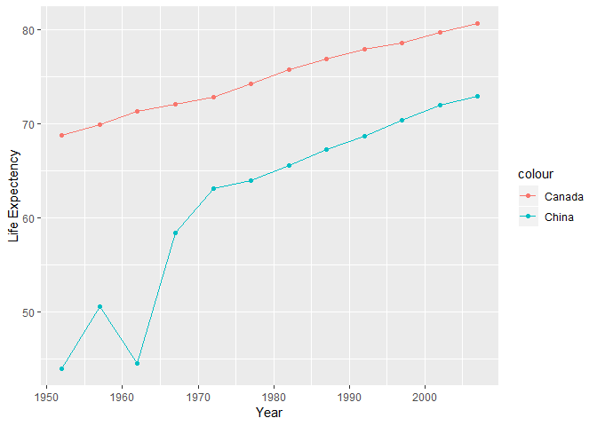

STAT 545A homework 4
================
Tian Gao
2018/10/2

# Bring rectangular data in

``` r
## load gapminder
library(gapminder)
## load tidyverse
library(tidyverse)
```

    ## -- Attaching packages ---------------- tidyverse 1.2.1 --

    ## √ ggplot2 3.0.0     √ purrr   0.2.5
    ## √ tibble  1.4.2     √ dplyr   0.7.6
    ## √ tidyr   0.8.1     √ stringr 1.3.1
    ## √ readr   1.1.1     √ forcats 0.3.0

    ## -- Conflicts ------------------- tidyverse_conflicts() --
    ## x dplyr::filter() masks stats::filter()
    ## x dplyr::lag()    masks stats::lag()

# Data Reshaping Prompts (and relationship to aggregation)

# Activity \#2

  - Make a tibble with one row per year and columns for life expectancy
    for two or more countries.
  - Use knitr::kable() to make this table look pretty in your rendered
    homework.
  - Take advantage of this new data shape to scatterplot life expectancy
    for one country against that of another.

<!-- end list -->

``` r
life_contrast<-gapminder %>%
# Filter the country to China and United States
  filter(country %in% c("China","Canada"))%>%
  select(year, country, lifeExp) %>%
# reshape the data, spread the country to columns, lifeExp as the values
  spread(country,lifeExp) %>%
  rename(Year = year)
knitr::kable(
  life_contrast
)
```

| Year | Canada |    China |
| ---: | -----: | -------: |
| 1952 | 68.750 | 44.00000 |
| 1957 | 69.960 | 50.54896 |
| 1962 | 71.300 | 44.50136 |
| 1967 | 72.130 | 58.38112 |
| 1972 | 72.880 | 63.11888 |
| 1977 | 74.210 | 63.96736 |
| 1982 | 75.760 | 65.52500 |
| 1987 | 76.860 | 67.27400 |
| 1992 | 77.950 | 68.69000 |
| 1997 | 78.610 | 70.42600 |
| 2002 | 79.770 | 72.02800 |
| 2007 | 80.653 | 72.96100 |

``` r
# fix names with spaces
 life_contrast%>% 
  ggplot() +
  # make a line plot with points for Australia
  geom_line(aes(Year, China, color = "China")) +
  geom_point(aes(Year, China, color = "China")) +
  # make a line plot with points for New_Zealand
  geom_line(aes(Year, Canada, color = "Canada")) +
  geom_point(aes(Year, Canada, color = "Canada")) +
  labs(y = "Life Expectency")
```

<!-- -->

  - Next I’ll show the scatterplot that shows life expectancy for this
    two countries.

<!-- end list -->

``` r
life_contrast %>%
  ggplot(aes(China, Canada,color=factor(Year)))+
  geom_point()+
  xlim(40,85)+
  ylim(40,85)+
  coord_fixed()+
  geom_abline(intercept = 0, slope = 1)
```

<!-- --> \# Join Prompts
(join, merge, look up)

## Activity \#1

  - Problem: You have two data sources and you need info from both in
    one new data object.

  - Solution: Perform a join, which borrows terminology from the
    database world, specifically SQL.

  - Create a second data frame, complementary to Gapminder. Join this
    with (part of) Gapminder using a dplyr join function and make some
    observations about the process and result. Explore the different
    types of joins. Examples of a second data frame you could build:

  - One row per country, a country variable and one or more variables
    with extra info, such as language spoken, NATO membership, national
    animal, or capitol city.

  - One row per continent, a continent variable and one or more
    variables with extra info, such as northern versus southern
    hemisphere.
